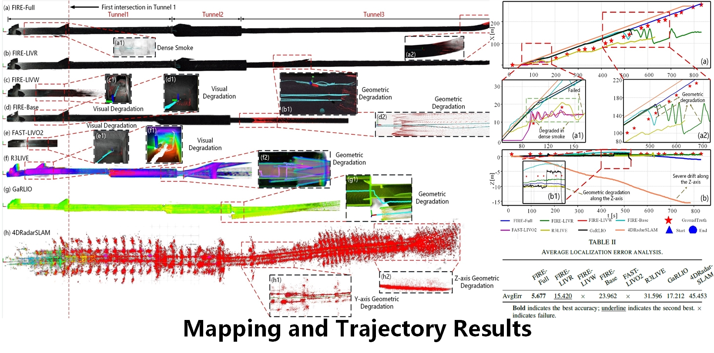
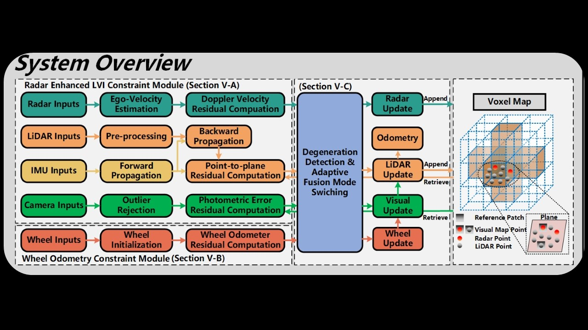
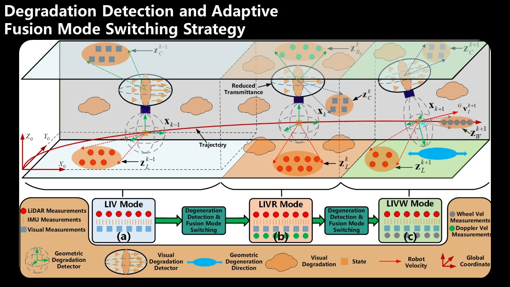
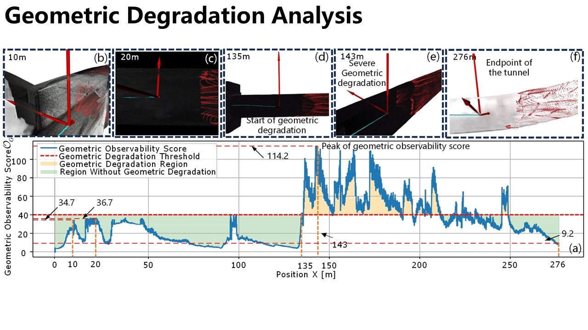
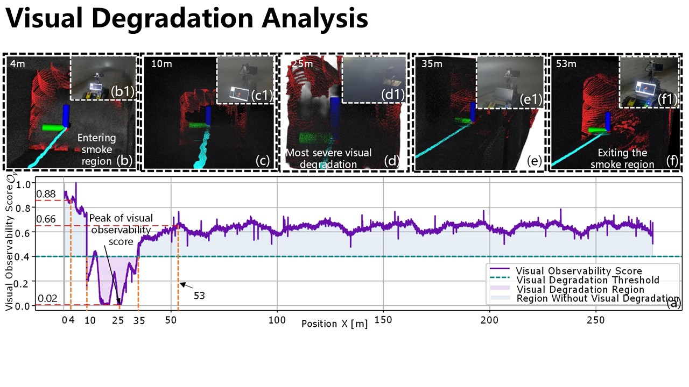

<div align="center">

# FIRE-LIVWO

### Robust LiDAR-Inertial-Visual-Wheel Odometry via Failure-Immune mmWave Radar Enhancement

**IEEE/RSJ International Conference on Intelligent Robots and Systems (IROS 2026)**

[Kun Hu](https://github.com/KJ-Falloutlast)<sup>1</sup> ·
[Menggang Li](https://orcid.org/0000-0002-2395-9543)<sup>1,†</sup> ·
[Kaidi Wu](https://orcid.org/0009-0005-3938-7454)<sup>1</sup> ·
[Zhiwen Jin](https://orcid.org/0009-0008-6412-4711)<sup>1</sup> ·
Yingjie Zhao<sup>1</sup> ·
[Chaoquan Tang](https://orcid.org/0000-0003-1641-9845)<sup>1</sup> ·
[Eryi Hu](https://orcid.org/0000-0002-3932-4542)<sup>2</sup> ·
[Gongbo Zhou](https://orcid.org/0000-0002-8672-2535)<sup>1</sup>

<sup>1</sup> China University of Mining and Technology, Xuzhou, China<br>
<sup>2</sup> Information Institute, Ministry of Emergency Management, China<br>
<sup>†</sup> Corresponding author

[](https://kj-falloutlast.github.io/FIRE-LIVWO/)
[](FIRE_LIVWO_Robust_LiDAR_Inertial_Visual_Wheel_Odometry_via_Failure_Immune_mmWave_Radar_Enhancement.pdf)
[](IROS26_4178_VI_i.mp4)

[](https://2026.ieee-iros.org/)
[](https://github.com/KJ-Falloutlast/FIRE-LIVWO/stargazers)

**[Project Page](https://kj-falloutlast.github.io/FIRE-LIVWO/)** ·
**[Paper](FIRE_LIVWO_Robust_LiDAR_Inertial_Visual_Wheel_Odometry_via_Failure_Immune_mmWave_Radar_Enhancement.pdf)** ·
**[Video](IROS26_4178_VI_i.mp4)** ·
**[Figures](figs/)** ·
**[Citation](#citation)**

</div>

<p align="center">
  <a href="https://kj-falloutlast.github.io/FIRE-LIVWO/">
    
  </a>
  <br>
  <em>FIRE-LIVWO completes the smoke-filled and geometrically degenerate tunnel sequence while the evaluated baselines drift or fail. Click the image to visit the project page.</em>
</p>

## At a glance

FIRE-LIVWO is a tightly coupled **LiDAR–inertial–visual–wheel odometry** system enhanced by **4D mmWave radar** for large-scale underground coal mines. It addresses two distinct but frequently coupled failures: smoke-induced visual degradation and geometric underconstraint in long, repetitive corridors. Radar, LiDAR, vision, wheel odometry, and IMU measurements are fused in an iterated error-state Kalman filter (IESKF), while online observability analysis selects the appropriate fusion mode.

| Smoke robustness | Corridor robustness | Online detection | Estimator |
|:---:|:---:|:---:|:---:|
| Radar geometry + Doppler velocity | Wheel odometry + NHC | Visual + geometric observability | Tightly coupled IESKF |

> [!NOTE]
> This release contains the accepted paper, one-minute supplementary video, and publication figures. The implementation and dataset are not included in the current repository snapshot.

## News

- **2026-08-23** — Paper, supplementary video, figures, and project page released.
- **2026-06** — FIRE-LIVWO accepted to **IROS 2026**. 🎉

## Method

<p align="center">
  
  <br>
  <em>System overview. Radar, LiDAR, visual, wheel, and inertial constraints are scheduled by online degradation detection and fused within one IESKF pipeline.</em>
</p>

FIRE-LIVWO contributes four tightly connected components:

1. **Unified radar–LiDAR–visual map.** LiDAR and radar point-to-plane residuals share an adaptive VoxelMap with sparse direct visual photometric residuals.
2. **Failure-immune radar enhancement.** Radar geometric observations and pointwise Doppler-velocity residuals preserve motion information when smoke suppresses image contrast and corrupts LiDAR returns.
3. **Wheel-aided geometric robustness.** Wheel odometry, nonholonomic constraints (NHC), and online lever-arm compensation reduce drift along underconstrained tunnel directions.
4. **Observability-aware adaptive fusion.** Visual and geometric scores identify degradation online and switch among LIV, LIVR, LIVW, and LIVRW modes.

<p align="center">
  
  <br>
  <em>Adaptive fusion. Radar constraints are activated for visual degradation, wheel constraints for geometric degradation, and both for simultaneous failures.</em>
</p>

| Condition | Detector state | Fusion mode | Active complementary constraint |
|---|:---:|:---:|---|
| Nominal | `Dᵥ = 0`, `Dɢ = 0` | LIV | LiDAR + IMU + vision |
| Visual degradation | `Dᵥ = 1`, `Dɢ = 0` | LIVR | 4D radar Doppler velocity |
| Geometric degradation | `Dᵥ = 0`, `Dɢ = 1` | LIVW | Wheel odometry + NHC |
| Dual degradation | `Dᵥ = 1`, `Dɢ = 1` | LIVRW | Radar + wheel constraints |

## Real-world results

Experiments were conducted with a Husky A200 carrying a Livox AVIA LiDAR/IMU, Hikvision camera, Oculii Eagle 4D mmWave radar, and wheel odometer. The route spans three underground tunnels with dense smoke, sparse geometry, and repetitive structure. Accuracy is evaluated against **20 total-station control points**.

| Method | Average localization error ↓ |
|---|---:|
| **FIRE-Full (ours)** | **5.677 m** |
| FIRE-LIVR | 15.420 m |
| FIRE-LIVW | Failure |
| FIRE-Base | 23.962 m |
| FAST-LIVO2 | Failure |
| R3LIVE | 31.596 m |
| GaRLIO | 17.212 m |
| 4DRadarSLAM | 45.453 m |

<table>
  <tr>
    <td width="50%"></td>
    <td width="50%"></td>
  </tr>
  <tr>
    <td align="center"><em>Geometric observability identifies the underconstrained tunnel interval.</em></td>
    <td align="center"><em>Visual observability tracks entry into and recovery from dense smoke.</em></td>
  </tr>
</table>

## Paper and video

| Artifact | Description | Link |
|---|---|---|
| Paper | Accepted IROS 2026 manuscript · 8 pages | [Download PDF](FIRE_LIVWO_Robust_LiDAR_Inertial_Visual_Wheel_Odometry_via_Failure_Immune_mmWave_Radar_Enhancement.pdf) |
| Video | IROS 2026 supplementary video · 60 s · 1080p | [Watch MP4](IROS26_4178_VI_i.mp4) |
| Figures | System, switching strategy, mapping, and degradation analyses | [Browse figures](figs/) |

## Repository layout

```text
FIRE-LIVWO/
├── FIRE_LIVWO_..._Radar_Enhancement.pdf  # accepted paper
├── IROS26_4178_VI_i.mp4                  # supplementary video
├── figs/                                 # publication and presentation figures
├── assets/                               # project-page styles, scripts, and icons
├── index.html                            # GitHub Pages project website
├── CITATION.cff                          # machine-readable citation metadata
└── README.md
```

## Citation

If FIRE-LIVWO is useful in your research, please cite the IROS 2026 paper and consider starring this repository.

```bibtex
@inproceedings{hu2026firelivwo,
  author    = {Kun Hu and Menggang Li and Kaidi Wu and Zhiwen Jin and Yingjie Zhao and Chaoquan Tang and Eryi Hu and Gongbo Zhou},
  title     = {{FIRE-LIVWO}: Robust {LiDAR}-Inertial-Visual-Wheel Odometry via Failure-Immune mmWave Radar Enhancement},
  booktitle = {2026 IEEE/RSJ International Conference on Intelligent Robots and Systems (IROS)},
  year      = {2026}
}
```

## Acknowledgments

We thank the authors of [FAST-LIO2](https://github.com/hku-mars/FAST_LIO), [FAST-LIVO2](https://github.com/hku-mars/FAST-LIVO2), [R3LIVE](https://github.com/hku-mars/r3live), [GaRLIO](https://github.com/ChiyunNoh/GaRLIO), and [4DRadarSLAM](https://github.com/zhuge2333/4DRadarSLAM) for advancing robust multi-modal state estimation.

For questions about the paper or released materials, please [open an issue](https://github.com/KJ-Falloutlast/FIRE-LIVWO/issues).

<div align="center">

Built for continuous state estimation when visibility and geometry fail together.

</div>
